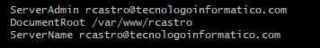
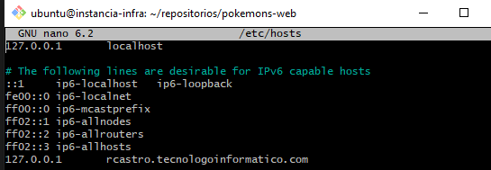
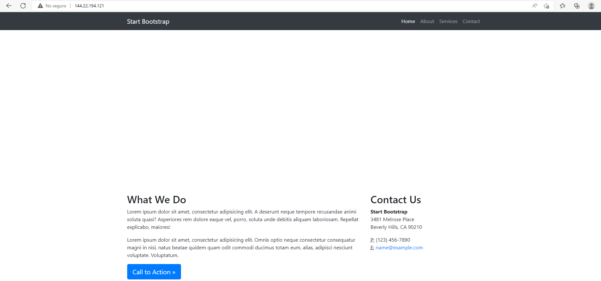

# apache

Reemplace `$ALUMNO` por el nombre de su nombre de usuario en www.tecnologoinformatico.com

EJ: `dmascheroni`

1. Cree el directorio ~/repositorios y dentro clone el
repositorio: `https://github.com/TecnologoInformatico/AdmInf-web.git`
2. Actualice el repositorio de la lista de paquetes.
    `apt update`
3. Instalar el servidor Apache mediante apt.
4. Cree el directorio /var/www/$ALUMNO
5. Asigne como propietario del directorio su usuario.
6. Configure un nuevo Virtual host. (copiando el archivo de configuración por defecto)
  6.1. ServerName $ALUMNO.tecnologoinformatico.com
  6.2. Correo de contacto con el administrador.
  6.3. El root de la aplicación. (/var/www/$ALUMNO)
7. Modifique el archivo /etc/hosts de modo que el ServerName coincida con este equipo `127.0.0.1`.
8. Reinicie el servidor apache para que los cambios tengan efecto.
9. Copie el contenido del directorio ~/repositorios/AdmInf-web a /var/www/$ALUMNO, de tal modo que el contenido del repositorio antes clonado se encuentre en el root de la aplicación.
10. Verifique que el servidor funcione correctamente.
11. Ingrese la IP del servidor y el servername a continuación:

```json
{
    "serverName": "",
    "ip": ""
}
```


## Solucion

1. <code>mkdir repositorios</code> 
   <code> git clone https://github.com/TecnologoInformatico/AdmInf-web.git</code> 
<br>

2. <code>sudo apt update</code>

3. instalacion de apache
<br>
<code>
   sudo apt install apache2
</code> 
<br>

4. crear directorio
<br>
<code>
    export ALUMNO=rcastro
    sudo mkdir  /var/www/$ALUMNO
</code> 
<br>

5. asignar permisos
<br>
<code>
    sudo chown $USER: /var/www/$ALUMNO
</code> 
<br>

6. <code>cd  /var/www/$ALUMNO</code>
   <br>
    <code>nano index.html </code> dentro escribi un html basico
    <br>
   <code>cd /etc/apache2/sites-available/ </code>
   <br>
   <code>sudo cp 000-default.conf gci.conf</code>
   <br>
   <code>nano sudo nano gci.conf</code>
   <br>
   
   <br>
  <code>sudo a2ensite gci.conf</code>
  <br>
  <code>service apache2 reload</code>

7. <code>sudo nano /etc/hosts</code> <br>



8. <code>service apache2 reload</code> <br>

9. <code>sudo cp -a ~/repositorios/AdmInf-web/. /var/www/$ALUMNO</code> <br>

10.  
 
 
  resultado
  
  


  


